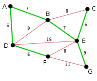

## Datos del integrante

* Nombre     -> Julio Cesar Torres Escobedo
* No. Cuenta -> 317336267

# Algoritmo Kruskal

## Descripcion

Nuestro algoritmo consiste en implementar el algoritmo kruskal en una grafica que es recibida en la linea del codigo un archivo ".txt". Dentro del archivo ".txt" se tendra que dividir de la siguiente manera:

```
1,2,3,4,5,6,7,8,9 -> Vertices de la grafica
1,2:2 -> Arista1
3,4:1 -> Arista2
5,6:4 -> Arista3

```

Dentro del archivo tenemos que cumplir que las aristas tengan tamaño 3, si el vertice no existe arroja error, si la arista ya existe simplemente la omite y si el peso es negativo arroja error, añadimos las aristas de forma que el vertices menor sea el vertice origen y el vertice mayor sea el vertice destino. Los vertices de igual manera, si se repite entonces omitimos.

## Entrada

Todas las entradas seran por medio de un archivo ".txt". Nuestra primera linea de texto seran los vertices a los que pertenecera la grafica y las siguientes lineas solo necesitan tener 2 vertices, estos vertices formaran una arista.

## Salida

Nuestra salida mostrara lo siguiente:

```
========== ALGORITMO KRUSKAL ========== 


---Agregando vertices                       -> Los vertices que se estan agregando

---Agregando aristas                        -> Las aristas que se agregan


==========  GRAFICA ========== 

# Los vertices de nuestra grafica son:      -> Los vertices de nuestra grafica

# Las aristas de nuestra grafica son:       -> Las aristas de nuestra grafica

==========  ALGORITMO ==========            -> Implementacion del algoritmo

-- ITERACION  --                            -> Numero de iteracion

-> Aristas ordenadas:                       -> Pila de prioridad

---- Conjunto ----                          -> El conjunto con su respectiva informacion

========== GRAFICA KRUSKAL ==========       -> La grafica ya implementada con kruskal

```


## Compilar

Para compilar nuestro programa, nos colocamos en el directorio "src" y escribimos:

```sh
javac kruskal\Main.java
```

## Ejecucion

Para ejecutar nuestro programa, escribimos:

```sh
java kruskal.Main ejemplo.txt
```

## Ejemplo

Nos basamos en las siguientes imagenes para el ejemplo.txt. 

La primera imagen es la grafica normal:


La segunda imagen es la grafica implementada con Kruskal:



Observamos que el algoritmo si realiza de manera correcta la implementacion.